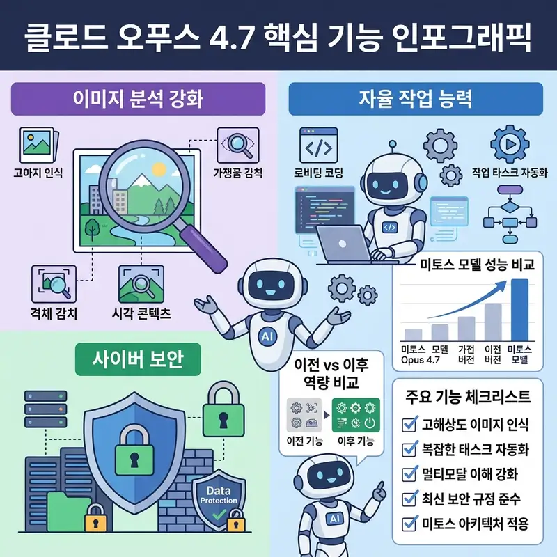

클로드 AI의 최신 버전인 Opus 4.7이 4월 16일 출시되었습니다. 이번 업데이트에서는 이미지 분석 능력과 에이전틱 자율 작업 능력이 크게 향상되었으며, 사이버 보안 안전장치가 추가되었습니다. 또한, 아직 출시되지 않은 미토스 모델의 성능도 공개되어 많은 관심을 끌고 있습니다.

[AI 뉴스 브리핑](https://aikorea24.kr)

## Opus 4.7 업데이트 주요 내용

Opus 4.7은 클로드 AI의 가장 강력한 범용 모델로 자리 잡고 있으며, 가격은 전작인 Opus 4.6과 동일하게 유지되었습니다. 입력 비용은 백만 토큰당 5달러, 출력 비용은 백만 토큰당 25달러입니다.

이번 업데이트의 주요 변경 사항은 다음과 같습니다.

* 이미지 분석 능력 대폭 강화: 이전 버전보다 3배 이상 선명하게 이미지를 분석할 수 있으며, 복잡한 표나 작은 글씨가 빽빽한 문서, 앱 화면 캡처 등을 훨씬 정확하게 읽어낼 수 있습니다.
* 에이전틱 자율 작업 능력 향상: 복잡한 코딩 작업이나 긴 업무를 처음부터 끝까지 스스로 처리할 수 있으며, 심지어 자기가 한 일을 스스로 검토하고 오류를 잡아내기도 합니다.
* API 주요 기술 변경: 새로운 노력 수준(Effort level)이 추가되어 코딩 및 에이전틱 작업에서 더 높은 성능을 끌어낼 수 있습니다.
  
  
* 사이버 보안 안전장치 추가: 훈련 과정에서 사이버 공격 능력을 의도적으로 낮추는 실험을 진행했으며, 금지된 고위험 사이버 보안 용도를 자동 감지 및 차단하는 안전장치를 탑재했습니다.

## 벤치마크 결과 및 미토스 모델 성능

Opus 4.7의 벤치마크 결과는 전작보다 향상된 모습을 보여주고 있습니다. 특히 에이전틱 코딩, 재무 분석, 대학원 수준의 추론, 시각적 추론에서 높은 점수를 기록하고 있습니다.

또한, 아직 출시되지 않은 미토스 모델의 성능도 공개되었는데, 에이전틱 코딩과 복잡하고 다학제적 추론, 에이전틱 서치 등 여러 부문에서 Opus 4.7을 능가하는 수치를 보여주고 있습니다.

## 클로드 AI 이용 방법 및 요금제

클로드 AI에 대한 관심이 높아지면서 멤버십별 금액대에 대한 고민도 늘어나고 있습니다. [겜스고 사이트](https://www.gamsgo.com/)를 통해 클로드 AI를 좀 더 저렴한 금액대에 이용할 수 있습니다. Pro, Max-5x, 공유 계정 중에서 선택이 가능하며, 

요금제 구성은 다음과 같습니다.

* Pro: 월 27,990원
* Max-5x: 월 130,530원
* 공유 계정: 월 8,600원

클로드 AI의 최신 버전인 Opus 4.7은 이미지 분석 능력과 에이전틱 자율 작업 능력이 크게 향상되어 다양한 분야에서 활용될 수 있을 것으로 기대됩니다. 또한, 미토스 모델의 성능 공개로 앞으로의 발전 가능성에도 많은 기대를 모으고 있습니다.
