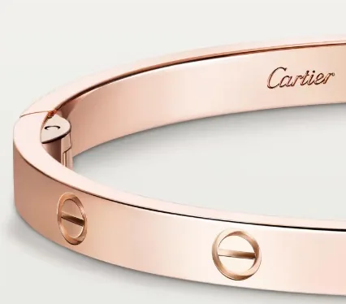
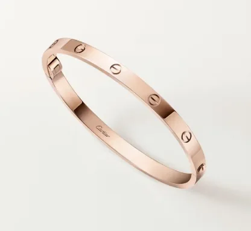

까르띠에 반지는 오랜 시간 동안 많은 사람들에게 사랑받는 아이템입니다. 특히 러브링, 트리니티링, 저스트앵끌루는 꾸준히 인기를 얻고 있죠. 하지만 명품 브랜드인 까르띠에는 가격 변동이 잦기 때문에, 구매를 고려하고 있다면 최신 가격 정보를 확인하는 것이 중요합니다. 실제로 최근 몇 년간 가격이 꾸준히 상승하고 있어, 조금이라도 저렴하게 구매하고 싶다면 시기를 잘 선택해야 합니다. 이 글에서는 2026년 4월 현재 까르띠에 반지 가격을 종류별로 상세하게 정리하여 여러분의 합리적인 구매를 돕고자 합니다.

<a href="https://www.cartier.com/ko-kr/home" target="_blank" rel="noopener" style="display:inline-block;padding:14px 32px;font-size:17px;border-radius:6px;background:#0066cc;color:#fff;text-decoration:none;font-weight:bold;box-shadow:0 2px 8px rgba(0,0,0,.15);">까르띠에 온라인 부띠끄 바로가기</a>

## 까르띠에 반지 가격 2026

까르띠에 공식 홈페이지에서 제공하는 정보를 바탕으로 다양한 반지 라인의 가격을 비교해 보았습니다. 같은 라인이라도 두께, 소재, 다이아몬드 세팅 여부에 따라 가격이 크게 달라지므로, 원하는 디자인과 예산에 맞춰 신중하게 선택해야 합니다. 특히 커플링이나 웨딩링으로 많이 찾는 반지들의 가격 변화를 살펴보면, 최근 가격 인상이 꽤 있었음을 알 수 있습니다. 정확한 정보는[까르띠에 - 공식 온라인 부티크](https://www.cartier.com/ko-kr/home)에서 확인하는 것을 추천합니다.

## 까르띠에 트리니티링 가격

트리니티링은 세 개의 꼬인 듯한 디자인이 특징으로, 까르띠에의 대표적인 아이콘 중 하나입니다. 스몰 사이즈부터 라지 사이즈까지 다양한 두께로 출시되며, 소재와 다이아몬드 세팅에 따라 가격이 달라집니다.

* 트리니티링 스몰 2.5mm: 2,040,000원
* 트리니티링 클래식 3.2mm: 2,800,000원
* 트리니티링 라지 4.4mm: 5,000,000원
* 트리니티링: 2,710,000원
* 트리니티링 미디엄 3.2mm 다이아몬드 5개 세팅: 4,030,000원

트리니티링은 심플하면서도 세련된 디자인으로 어떤 스타일에도 잘 어울립니다. 특히 여러 개의 트리니티링을 레이어드하여 착용하는 것도 인기 있는 스타일링 방법입니다.

## 까르띠에 러브링 가격

러브링은 나사 모양의 독특한 디자인이 특징으로, 사랑의 영원함을 상징합니다. 러브링 역시 두께와 소재, 다이아몬드 세팅에 따라 다양한 가격대로 만나볼 수 있습니다.

* 러브링 3.6mm (옐로우골드, 핑크골드): 1,790,000원
* 러브링 3.6mm (화이트골드): 1,920,000원
* 러브링 5.5mm (옐로우골드/핑크골드): 2,790,000원
* 러브링 5.5mm (화이트골드): 2,980,000원
* 러브링 플래티늄: 5,800,000원

**러브링은 커플링으로 인기가 매우 높으며**, 특히 다이아몬드 세팅 모델은 더욱 특별한 의미를 담아 선물하기 좋습니다. 러브링을 선택할 때는 손가락 마디가 편안하게 들어가는 사이즈를 선택하는 것이 중요합니다.

## 까르띠에 저스트 앵 끌루 (못반지) 가격

저스트앵끌루는 못 모양의 독특한 디자인으로 젊은층에게 인기가 높은 반지입니다. 스몰 사이즈부터 다양한 두께로 출시되며 소재와 다이아몬드 유무에 따라 가격이 달라집니다.

* 저스트앵끌루 스몰 1.8mm (핑크/옐로우 골드): 1,890,000원
* 저스트앵끌루 스몰 1.8mm (화이트 골드): 2,020,000원
* 저스트앵끌루  2.65mm (핑크/옐로우 골드):  3,810,00만원
* 저스트앵끌루  2.65mm (화이트 골드):  4,88만원
* 저스트앵끌루  다이아몬드 세팅 모델 :635만원~68만원

그렇다면 어떤 기준으로 골라야 할까요? 개인의 취향과 예산을 고려하여 가장 잘 어울리는 디자인과 소재를 선택하는 것이 중요합니다.. 또한 착용감도 중요한 요소이기 때문에 직접 착용해보고 결정하는 것을 추천합니다..

## 자주 묻는 질문

**Q. 까르띠에 반지 사이즈는 어떻게 선택해야 할까요?** 
A. 까르띠에 반지는 일반적인 반지 사이즈보다 약간 작게 나오는 경향이 있습니다. 따라서 매장에서 직접 착용해보고 정확한 사이즈를 측정하는 것이 가장 좋습니다.
\
**Q. 까르띠에 반지 관리는 어떻게 해야 할까요?** 
A. 까르띠에 반지는 부드러운 천으로 정기적으로닦아주는 것이 좋습니다. 또한 화학 물질이나 강한 충격으로부터 보호해야 합니다.
\
**Q . 까르띠에 반지 구매 시 주의사항은 무엇인가요?** 
A . 정품 여부를 확인하고 , 영수증 및 보증서를 잘 보관해야 합니다 . 또한 환불 규정을 미리 확인하는 것이 좋습니다 . 
\
**Q . 까르띠에 반지 선물 시 포장 서비스는 제공되나요 ?** 
A . 네 , 까르띠에는 선물 포장 서비스를 제공합니다 . 매장에서 요청하시면 고급스러운 포장으로 준비해 드립니다 . 

## 결론

오늘 살펴본 것처럼 까르띠에 반지는 종류와 디자인에 따라 가격대가 다양합니다.. 러브링과 트리니티링은 클래식하면서도 세련된 디자인으로 오랫동안 사랑받고 있으며 , 저스트앵끌루는 개성 넘치는 스타일을 연출하기 좋습니다.. 지금 바로 가까운 까르띠에 매장을 방문하여 직접 착용해보고 자신에게 가장 잘 어울리는 반지를 찾아보세요!