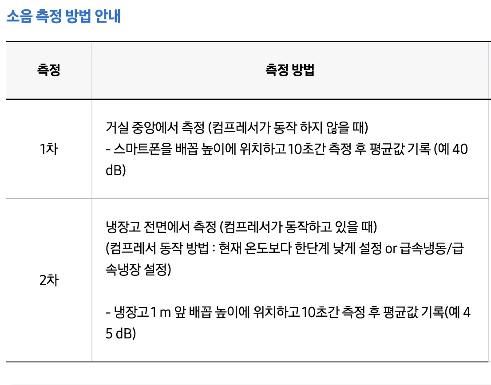

---

date: '2026-05-01T08:30:57+09:00'
title: 냉장고 소음 원인 알아보기 삼성전자 공식 안내 모터 팬 진동 증상
description: 냉장고 소음의 원인과 증상을 자세히 알아보고 해결 방법을 제시합니다. 모터, 팬, 진동 소리 등 다양한 소음 유형별 대처법을
  확인하세요.
tags: [냉장고, 소음, 고장, 원인, 증상, 자가진단, 해결방법, 생활정보]
categories: [가전제품, 생활팁]
source_file: 1591_냉장고_소음_원인_알아보기_모터,_팬,_진동_소리_증상.md
cover:
  image: "thumbnail.webp"
  alt: ""
  hidden: false
slug: 20260429-002000-냉장고-소음-원인-알아보기-모터-팬-진동-소리-증상

---

냉장고에서 나는 소리는 때로는 불편함을 넘어 걱정거리가 됩니다. 이사 후 갑자기 들리는 소음은 혹시 냉장고에 문제가 생긴 건 아닐까 하는 불안감을 안겨주죠. 저 역시 최근 이사하면서 냉장고에서 위이잉하는 이상한 소리가 들려 밤잠을 설쳤습니다. 심각한 고장일까 염려하며 찾아본 내용을 정리해 공유하고자 합니다. 이 글을 통해 냉장고 소음의 원인을 파악하고, 스스로 해결할 수 있는 방법을 찾아보세요.

아래의 삼성전자 냉장고 소음관련 페이지에서는 소음측정방법등 더 자세한 내용을 확인할 수 있습니다.

<a href="https://www.samsungsvc.co.kr/solution/38807" target="_blank" rel="noopener" style="display:inline-block;padding:14px 32px;font-size:17px;border-radius:6px;background:#0066cc;color:#fff;text-decoration:none;font-weight:bold;box-shadow:0 2px 8px rgba(0,0,0,.15);">삼성전자 냉장고소음 안내 페이지</a>

## 냉장고 소음 원인과 종류

냉장고 소음의 가장 흔한 원인은 진동입니다. 새로운 환경에 놓인 냉장고는 팬 모터와 냉각 모터가 작동하면서 진동을 발생시키기 쉽습니다. 또한, 바닥이 고르지 않거나 설치 공간이 좁으면 진동이 증폭되어 더욱 크게 들릴 수 있습니다. 문을 열고 닫을 때나 주변 공간이 좁을 때도 소음이 커질 수 있다는 점을 기억하세요. 먼저 냉장고 주변 환경을 점검해보는 것이 좋습니다. 바닥 상태를 확인하고, 냉장고가 흔들리는지, 설치 공간이 충분한지 살펴보세요. 작은 조치만으로도 소음을 줄일 수 있습니다.

### 냉장고 소리 증상 모음

#### 모터 소음: 웅- , 달칵, 달그락, 뚝뚝

모터 소음은 냉장고의 심장과 같은 역할을 하는 압축기에서 발생하는 경우가 많습니다. 설치 장소의 바닥이 평평하고 단단한 곳에 설치해야 하며, 뒷면과 옆면에 최소 5cm 이상의 공간을 확보해야 합니다. 또한, 냉장고 뒷면 기계실 주변에 먼지가 쌓이면 과열로 인해 소음이 커질 수 있으므로 주기적인 청소가 필요합니다. 기계적인 소음(덜거럭, 금속적인 굉음 등)이 발생하면 전문가의 점검을 받는 것이 안전합니다.

#### 팬 소음: 팬 모터 소음, 드르륵, 웅, 웽, 다다닥

팬은 냉기를 순환시키는 중요한 역할을 합니다. 도어 개폐와 무관하게 지속적으로 발생하는 팬 소음은 크기가 크지 않다면 정상적인 작동 소리일 수 있습니다. 하지만 팬에 이물질이 끼거나 모터가 얼어붙으면 다다닥거리는 불쾌한 소리가 날 수 있습니다. 이 경우 모터와 냉각기에 결빙된 부분을 해빙해야 합니다. 여름철에는 하루 정도, 겨울철에는 3일 정도 전원 코드를 뽑아두면 해결될 수 있습니다.

#### 캐비닛 소음: 뚜둑, 뚝뚝, 딱딱, 똑똑, 뚝, 또독 (플라스틱소리)

캐비닛 소음은 냉장고 내부 온도 및 압력 변화로 인해 플라스틱 벽면이나 선반이 미세하게 수축/팽창하면서 발생합니다. 페트병이 오무라들었다가 펴질 때 나는 소리와 비슷하다고 생각하면 이해하기 쉬울 것입니다. 선반이나 서랍의 틈새를 확인하고 완전히 밀어 넣어 조치해보세요.

#### 냉매 소음: 물 흐르는 소리, 꾸르륵, 쪼르릇, 칙, 쉭

냉매는 냉기를 만들어 순환시키는 역할을 합니다. 액체에서 기체로 변하고 다시 액체로 변하는 과정에서 물 흐르는 듯한 소리가 날 수 있습니다. 이는 정상적인 현상이지만 온도가 정상이 아니고 소음이 심하다면 점검을 받아봐야 합니다.

**핵심 정리:** 냉장고 소음은 다양한 원인으로 발생하며, 대부분 간단한 조치로 해결 가능합니다. 하지만 지속적인 이상 소음은 전문가의 도움을 받는 것이 안전합니다. 특히 기계적인 소음이나 냉매 관련 문제는 반드시 점검받아야 합니다.

### 문제 해결을 위한 체크리스트

* 냉장고 수평 조절하기 (바닥 다리 홈에 드라이버를 넣어 수평 맞추기)
* 냉장고 뒷 부분 공간 확보하기 (충분한 간격 유지)
* 소리 크기 변화 패턴 확인하기 (규칙적인 패턴인지 불규칙적인 패턴인지)
* 냉기 온도 정상인지 체크하기
* 정기적인 청소 및 먼지 제거하기

## 자주 묻는 질문

**Q. 냉장고 문을 열 때마다 '쿵'하는 소리가 나는데 괜찮나요?**
A. 가동 정지 시 발생하는 자연스러운 소리일 수 있습니다. 하지만 문을 열 때마다 과도하게 큰 '쿵'하는 소리가 난다면 부품의 마모나 손상을 의심해보고 전문가에게 문의하는 것이 좋습니다.

**Q. 냉매 가스가 순환되는 '칙'하는 소리는 항상 나는 건가요?**
A. 네, 정상적인 작동 과정에서 발생하는 소리입니다. 하지만 온도가 정상이 아니고 '칙'하는 소리가 지나치게 크다면 냉매 누출 가능성을 의심해봐야 합니다.

**Q. 팬에 먼지가 많이 쌓이면 어떻게 해야 하나요?**
A. 전원 코드를 뽑은 후 부드러운 솔이나 진공청소기를 이용하여 조심스럽게 먼지를 제거하세요. 너무 강하게 청소하면 팬 날개가 손상될 수 있으니 주의해야 합니다..

**Q .냉각 모터(컴프레서) 열 방출을 위한 팬 작동소리가 심하게 나는데 어떻게 해야 할까요?**
A . 불규칙적으로 반복된다면 정확한 점검을 위해 AS를 신청하는 것이 좋습니다..

## 결론

냉장고에서 나는 다양한 종류의 소음은 단순히 귀찮은 문제가 아니라 제품의 잠재적인 고장을 알리는 신호일 수도 있습니다.. 오늘 살펴본 내용들을 바탕으로 스스로 문제를 해결하거나 적절한 조치를 취하여 더욱 안전하고 편안하게 생활하시길 바랍니다.. 지금 바로 냉장고 주변 환경을 점검하고 필요한 조치를 취해보세요!