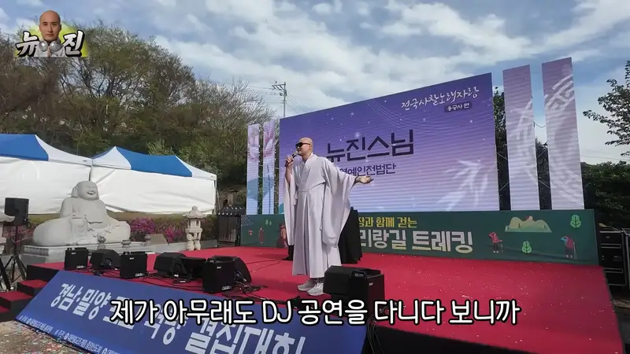
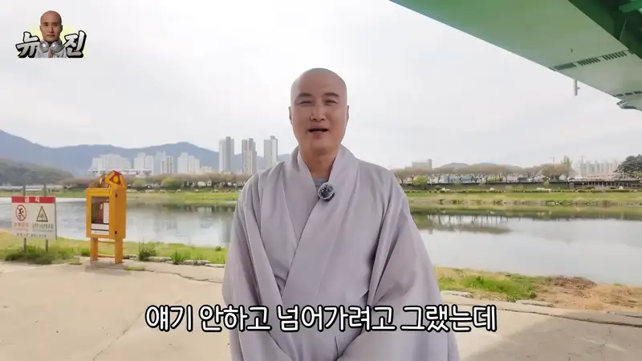

1976년 11월 10일 서울 용산구에서 태어난 윤성호는 49세의 현재, 대한민국 연예계에서 독보적인 존재감을 드러내고 있습니다. 호서대학교 신학과 중퇴 후 동아방송대학 연극영화과 전문학사를 취득하며 연예계에 발을 들였지만, 무명 시절을 겪어야 했습니다. 그러나 끊임없는 노력과 열정으로 개그맨으로서 성공을 거두었으며, 최근에는 뉴진스님이라는 새로운 이름으로 음악 활동까지 펼치며 많은 이들에게 깊은 감동과 영감을 주고 있습니다. 그의 삶은 단순히 성공한 연예인의 이야기가 아닌, 불교적 가치관을 바탕으로 한 진정한 행복과 성장의 메시지를 담고 있습니다. 이 글에서는 윤성호 개그맨의 연예 경력, 뉴진스님으로서의 새로운 도전, 그리고 그가 전하는 삶의 지혜를 심층적으로 분석하고, 그의 성공 비결과 앞으로의 계획을 함께 살펴보고자 합니다.

## 개그맨 윤성호의 연예 경력: 무명 시절부터 현재까지의 성장 과정

윤성호는 2001년 데뷔 이후 꾸준히 활동하며 대중적인 인지도를 쌓아왔습니다. 그는 특유의 유머 감각과 재치 있는 입담으로 많은 사람들에게 웃음을 선사하며 '빡구' 캐릭터로 큰 사랑을 받았습니다. 그의 개그 활동은 유튜브 채널을 통해 더욱 확산되었으며, 젊은 세대에게 큰 인기를 얻었습니다. 특히 유튜브 채널 ‘윤성호’는 구독자 30만 명 이상을 보유하며 많은 사랑을 받고 있습니다. 그의 유튜브 콘텐츠는 단순한 코미디를 넘어, 삶에 대한 철학적인 메시지를 담고 있어 많은 사람들에게 공감을 얻고 있습니다. 이러한 노력 덕분에 그는 현재 티엔엔터테인먼트 소속으로 다양한 방송 프로그램에 출연하며 활발하게 활동하고 있습니다.

## '빡구' 캐릭터를 통한 전성기 그리고 음악 활동의 시작

윤성호는 '빡구'라는 캐릭터를 통해 2000년대 후반부터 2010년대 초반까지 대한민국 코미디계에서 큰 인기를 누렸습니다. 그의 '빡구' 캐릭터는 과장된 표정과 몸짓, 그리고 예측 불가능한 유머로 많은 사람들에게 웃음을 선사했습니다. 특히 그의 유튜브 채널은 젊은 세대에게 큰 인기를 얻으며 코미디 유튜브 채널의 새로운 지평을 열었습니다. 그는 '빡구' 캐릭터를 통해 대중적인 인지도를 높였으며, 이를 바탕으로 다양한 방송 프로그램에 출연하며 활발하게 활동했습니다.

2023년, 윤성호는 갑작스럽게 뉴진스님이라는 새로운 이름으로 음악 활동을 시작했습니다. 그는 불교 수행을 통해 얻은 깨달음을 바탕으로 음악을 만들고 공연하며 많은 사람들에게 감동과 영감을 주고 있습니다. 그의 음악은 불교적 가치관과 현대 사회의 고민을 담고 있으며, 많은 사람들에게 공감을 얻고 있습니다. 그는 불교적 가치관을 바탕으로 한 음악 활동을 통해 새로운 팬층을 확보하고 있으며, 앞으로 더욱 다양한 음악 활동을 펼칠 것으로 기대됩니다.

## 뉴진스님으로의 새로운 도전과 성공 요인 분석

윤성호가 뉴진스님으로 전환한 것은 단순한 개인적인 선택이 아니었습니다. 그는 불교 수행을 통해 얻은 깨달음을 바탕으로 자신의 삶과 가치관에 대한 근본적인 질문을 던졌습니다. 그는 자신의 과거 경험과 현재의 삶을 되돌아보며 진정한 행복과 성장의 의미를 찾고자 했습니다. 이러한 고민 끝에 그는 불교적 가치관을 바탕으로 한 새로운 삶을 선택했으며, 이를 통해 새로운 도전을 시작했습니다.

윤성호가 뉴진스님으로 전환하여 성공할 수 있었던 요인은 다음과 같습니다. 첫째, 그는 자신의 과거 경험과 강점을 활용했습니다. 그는 개그맨으로서 쌓아온 유머 감각과 재치 있는 입담을 유지하면서도 불교적 가치관에 맞는 새로운 콘텐츠를 제작했습니다. 둘째, 그는 진정성을 보여주었습니다. 그는 자신의 삶과 가치관에 대한 솔직한 이야기를 공유하며 많은 사람들에게 공감을 얻었습니다. 셋째, 그는 꾸준히 노력했습니다. 그는 불교 수행뿐만 아니라 음악 활동에도 꾸준히 노력하며 자신의 역량을 발전시켰습니다. 이러한 노력 덕분에 그는 짧은 기간 동안 큰 성공을 거두었습니다.

## 결혼 및 가족 관계: 솔직한 인간적인 모습과 과거 경험 공유

윤성호는 1976년 11월 10일 서울 용산구에서 태어나 호서대학교 신학과 중퇴 후 동아방송대학 연극영화과 전문학사를 취득했습니다. 그의 가족은 부모님과 형으로 이루어져 있으며, 가족들과 함께 행복하게 살아가고 있습니다. 그는 공개적으로 자신의 가족 관계에 대해 솔직하게 이야기하며 많은 사람들에게 인간적인 모습을 보여주고 있습니다.

윤성호는 과거 여러 차례 연애를 했지만 현재는 미혼입니다. 하지만 그는 결혼에 대한 생각을 밝힌 적이 없으며, 앞으로 결혼 여부에 대해서는 신중하게 결정할 것으로 보입니다. 하지만 그의 삶에서 가족과의 관계는 매우 중요하며, 가족들을 향한 사랑은 변함없습니다.

## 제2의 전성기: 성공 이후의 삶과 앞으로의 계획

윤성호는 뉴진스님으로서 음악 활동뿐만 아니라 다양한 분야에서 활동하며 제2의 전성기를 맞이하고 있습니다. 그는 앞으로도 불교적 가치관을 바탕으로 한 다양한 콘텐츠를 제작하고 공연하며 많은 사람들에게 감동과 영감을 줄 것으로 기대됩니다. 또한 그는 사회 문제 해결에도 적극적으로 참여하며 사회에 기여하고자 합니다. 그는 앞으로도 끊임없이 노력하고 발전하며 더욱 멋진 모습으로 많은 사람들에게 희망과 용기를 주었으면 합니다. 그가 보여주는 성공 스토리와 메시지는 앞으로 더 많은 사람들이 자신의 삶에 대한 의미를 찾도록 도와줄 것입니다.

## 자주 묻는 질문 (H2)

<strong>Q1. 윤성호는 현재 미혼인가요?</strong>

네, 윤성호는 현재 미혼입니다만 가족들과 행복하게 지내고 있습니다. 결혼 여부에 대해서는 신중하게 결정할 예정입니다.

<strong>Q2. 뉴진스님은 실제 스님인가요?</strong>

아니오, 뉴진스님은 실제 스님이 아닙니다만 불교적 가치관을 바탕으로 한 새로운 삶을 선택했습니다. 불교 수행을 통해 얻은 깨달음을 바탕으로 음악 활동 및 사회 활동에도 적극적으로 참여하고 있습니다.

<strong>Q3. 윤성호는 어떤 음악 활동을 하고 있나요?</strong>

윤성호는 불교적 가치관을 담은 음악 작업을 하고 있으며 유튜브 채널 및 공연 등을 통해 대중에게 선보이고 있습니다. 앞으로는 다양한 장르의 음악 작업을 시도할 계획입니다.

## 마무리

윤성호 개그맨은 무명 시절부터 끊임없는 노력과 열정으로 대한민국 연예계에서 성공한 대표적인 인물입니다. 그는 유머 감각과 재치 있는 입담으로 많은 사람들에게 웃음을 선사했으며, 유튜브 채널 ‘윤성호’를 통해 젊은 세대에게 큰 인기를 얻었습니다. 또한 최근에는 뉴진스님이라는 새로운 이름으로 음악 활동까지 펼치며 많은 사람들에게 감동과 영감을 주고 있습니다. 그가 보여주는 성공 스토리와 메시지는 앞으로 더 많은 사람들이 자신의 삶에 대한 의미를 찾도록 도와줄 것입니다. 윤성호 개그맨은 단순한 연예인이 아닌 진정한 행복과 성장을 추구하는 사람이자 사회에 기여하는 멋진 존재로 기억될 것입니다.