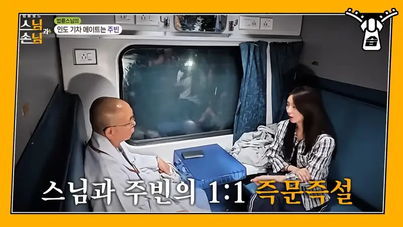
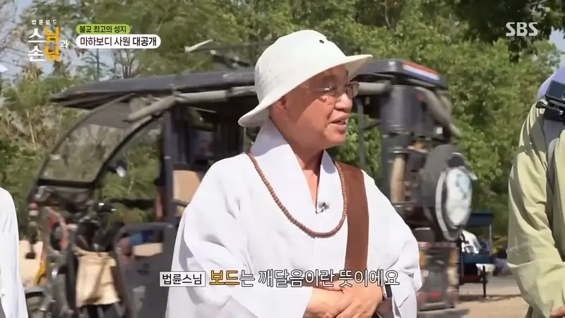

법륜 스님의 즉문즉설은 오랜 시간 동안 많은 사람들에게 깊은 울림과 깨달음을 선사해 왔습니다. 그의 따뜻한 시선과 진솔한 대화는 복잡한 세상 속에서 길을 잃은 이들에게 희망과 용기를 불어넣어 줍니다. 이번 법륜로드: 스님과 손님 방송에서는 법륜 스님이 인도 여행을 통해 얻은 삶의 지혜와 경험을 공유하며, 사회 문제 해결에 대한 새로운 관점을 제시할 예정입니다. 단순한 종교적인 메시지를 넘어, 실질적인 문제 해결 방안까지 다루며 시청자들에게 깊은 영감을 줄 것으로 기대됩니다. 정토회 공식 사이트에서 더 많은 정보를 확인하실 수 있습니다.

[법륜로드 다시보기](https://www.youtube.com/watch?v=aAyeMC4WQ4w)

## 법륜스님의 인도 여행 도전기 및 즉문즉설 과정 소개 - 법륜로드

법륜 스님은 1953년 경상남도 울산군에서 태어나 경주고등학교를 졸업하고 경주고등학교 재학 중 불교 입문을 했습니다. 분황사에서 도문 스님과의 만남을 통해 불교의 길로 나아게 되었고, 미국에서 서암 스님과의 만남을 통해 더욱 깊이 있는 수행을 이어갔습니다. 이후 정토회 설립을 통해 사회 공헌 활동에 힘쓰는 등 다양한 분야에서 활동하며 삶의 지혜를 나누어 왔습니다. 이러한 배경 속에서 법륜 스님은 인도 여행을 통해 얻은 경험과 깨달음을 즉문즉설 형태로 사람들과 나누고자 합니다.

법륜 스님의 인도 여행은 단순한 관광이 아닌, 삶의 지혜를 얻기 위한 수행의 일환이었습니다. 그는 인도에서 다양한 사람들을 만나 그들의 삶과 고통을 직접 경험하며 인간 존재의 본질에 대해 깊이 생각하게 되었습니다. 특히, 인도의 풍부한 문화와 역사 속에서 그는 삶의 의미와 가치에 대한 새로운 관점을 얻었으며, 이를 바탕으로 자신의 철학을 확립해 나갔습니다. 이러한 경험은 그의 즉문즉설에 깊이와 진정성을 더하는 중요한 요소가 됩니다.

## 법륜스님의 불교 입문 과정과 삶의 변화

법륜 스님은 경주고등학교 재학 중 불교 입문을 했습니다. 당시 그는 학업에 열중하며 바쁜 일상을 보내고 있었지만, 불교의 가르침을 접하면서 삶의 방향성을 찾게 되었습니다. 불교는 그에게 단순한 종교적 믿음을 넘어, 삶의 철학이자 가치관을 제시하는 중요한 역할을 했습니다. 그는 불교 수행을 통해 마음챙김과 자비심을 키우고, 세상 사람들과 소통하며 공존하는 방법을 배우게 되었습니다.

불교 입문 이후 법륜 스님의 삶은 이전과는 완전히 달라졌습니다. 그는 학업에 집중하는 대신 불교 수행에 몰두하며 내면의 평화를 찾았고, 사회 문제 해결에 적극적으로 참여하며 봉사 정신을 실천했습니다. 그의 삶은 끊임없는 자기 성찰과 노력으로 채워져 있으며, 이러한 노력 덕분에 그는 현재까지도 많은 사람들에게 존경받는 인물로 자리매김했습니다. 그가 추구하는 삶의 방식은 단순히 개인적인 행복뿐만 아니라 사회 전체의 평화와 번영을 위한 노력으로 이어지고 있습니다.

## 승려 자격 문제와 법륜스님의 철학적 입장 변화

법륜 스님은 조계종 규정에 따라 승려 자격을 받지 못했습니다. 이는 그의 철학적 입장 변화와 밀접하게 관련되어 있습니다. 전통적인 승려 생활에 대한 엄격한 규율과 절차는 그의 자유로운 사고방식과 창의적인 활동 방식을 제한한다고 생각했기 때문입니다. 그는 승려로서의 역할보다는 사회 문제 해결에 더욱 집중하고자 했으며, 이를 위해 기존의 틀에서 벗어나 새로운 시도를 해왔습니다.

법륜 스님은 승려 자격 문제를 단순히 개인적인 신분 문제로 여기지 않고, 사회 시스템 자체의 문제로 인식하고 있습니다. 그는 기존 체제에 대한 비판적 시각을 견지하면서도 사회 통합과 화합을 추구하며 균형 잡힌 입장을 취하고 있습니다. 그의 철학적 입장은 끊임없이 변화하고 발전하며, 사회 문제 해결이라는 궁극적인 목표를 향해 나아가고 있습니다. 이러한 변화는 그의 진솔한 성찰과 노력을 통해 이루어진 결과이며, 앞으로도 지속될 것으로 예상됩니다.

## 정토회 설립과 사회 공헌 활동의 전개 과정 및 의미

정토회는 1986년 법륜 스님에 의해 설립된 단체입니다. 정토회는 환경 운동, 통일 운동, 국제 구호 활동 등 다양한 분야에서 사회 공헌 활동을 펼치며 많은 사람들에게 도움을 주고 있습니다. 특히 환경 보호 운동에서는 지구 온난화와 기후 변화 문제를 해결하기 위한 다양한 캠페인을 진행하고 있으며, 통일 운동에서는 남북 화합과 평화 구축을 위한 노력을 기울이고 있습니다.

정토회는 단순히 재정적인 지원뿐만 아니라, 사회 구성원들의 자발적인 참여를 유도하여 지속 가능한 사회를 만들기 위해 노력하고 있습니다. 또한, 교육 프로그램을 통해 사회 문제에 대한 인식을 높이고 시민들의 역량을 강화하는 데에도 힘쓰고 있습니다. 정토회의 활동은 지역 사회뿐만 아니라 국제적으로도 큰 영향력을 미치며 많은 사람들에게 희망과 용기를 주고 있습니다. 그들의 노력은 더 나아가 세계 평화와 번영이라는 더 큰 목표를 향해 나아가는 중요한 발걸음입니다.

## 법륜스님의 인도 여행 노하우 및 삶의 지혜 공유

이번 방송에서는 법륜 스님이 인도 여행을 통해 얻은 다양한 경험과 깨달음을 공유할 예정입니다. 그는 인도에서 만난 사람들과 함께 생활하며 그들의 삶과 고통을 직접 경험했고, 이를 통해 인간 존재의 본질에 대해 깊이 생각하게 되었습니다. 특히 인도의 풍부한 문화와 역사 속에서 그는 삶의 의미와 가치에 대한 새로운 관점을 얻었으며, 이를 바탕으로 자신의 철학을 확립해 나갔습니다.

법륜 스님은 인도 여행에서 얻은 지혜를 바탕으로 실용적인 조언들을 제공할 것입니다. 예를 들어, 스트레스 해소 방법, 인간 관계 개선 방법, 행복한 삶을 위한 마음챙김 기술 등을 소개할 예정입니다. 또한 그는 사회 문제 해결 방안에 대한 다양한 아이디어를 제시하며 시청자들에게 영감을 줄 것입니다. 그의 이야기는 단순한 경험담이 아닌 인생의 지혜를 담고 있으며 시청자들에게 깊은 울림과 깨달음을 선사할 것입니다.

## 자주 묻는 질문

### Q1: 법륜스님은 어떤 분이신가요?

법륜스님은 불교 승려이자 사회 운동가입니다. 오랜 시간 동안 다양한 분야에서 활동하며 많은 사람들에게 영감을 주고 있습니다. 그의 따뜻한 마음씨와 진솔한 대화는 복잡한 세상 속에서 길을 잃은 이들에게 희망과 용기를 불어넣어 줍니다.

### Q2: 법륜스님은 왜 승려 자격을 받지 못했을까요?

법륜스님은 조계종 규정에 따라 승려 자격을 받지 못했습니다. 이는 그의 철학적 입장 변화와 관련되어 있는데, 그는 전통적인 승려 생활보다는 사회 문제 해결에 더욱 집중하고자 했습니다.

### Q3: 정토회는 어떤 활동을 하는 단체인가요?

정토회는 환경 운동, 통일 운동 등 다양한 분야에서 사회 공헌 활동을 펼치는 단체입니다. 특히 환경 보호 운동에서는 지구 온난화와 기후 변화 문제를 해결하기 위한 캠페인을 진행하고 있으며 통일 운동에서는 남북 화합과 평화 구축 노력을 기울이고 있습니다.

### Q4: 법륜스님의 즉문즉설은 어떤 내용인가요?

법륜스님의 즉문즉설은 다양한 주제에 대한 질문에 대해 진솔하고 명확하게 답변하는 형식으로 진행됩니다. 그는 자신의 경험과 지혜를 바탕으로 질문자들의 고민을 해결하고 현실적인 조언들을 제공합니다.

### Q5: 이번 방송에서 법륜스님은 어떤 내용을 다룰 예정인가요?

이번 방송에서는 법륜 스님이 인도 여행을 통해 얻은 경험과 깨달음을 공유하며 삶의 지혜를 나누려고 합니다. 특히 스트레스 해소 방법 및 행복한 삶을 위한 마음챙김 기술 등을 소개할 예정이며 시청자들에게 영감을 줄 것입니다.

## 마무리

이번 방송에서는 법륜 스님의 인도 여행 경험과 그 안에 담긴 삶의 지혜를 통해 우리 모두가 더 나은 세상을 만들어갈 수 있다는 희망을 전하고자 합니다. 법륜 스님의 따뜻한 시선과 진솔한 대화는 우리에게 용기와 위로를 주며 앞으로 나아갈 힘이 될 것입니다. 그가 제시하는 실용적인 조언들은 우리의 일상생활에서도 적용될 수 있으며 행복한 삶으로 이어질 수 있을 것입니다. 법륜 스님의 메시지는 우리 모두에게 평화롭고 행복한 미래를 향해 나아가는 동기 부여가 될 것입니다. 더 많은 정보는 정토회 공식 사이트 에서 확인하실 수 있습니다 .